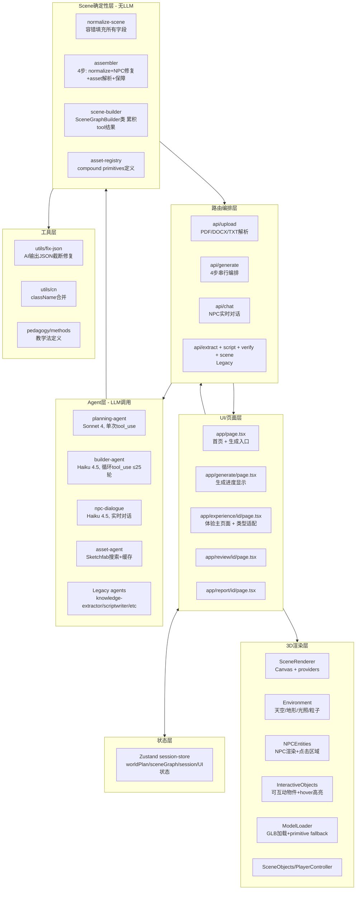

# ImmersaLearn 技术报告（Pipeline 与架构）

- 版本日期：2026-04-05（基于代码逐文件核查后更新）
- 项目：immersalearn（Next.js + React Three Fiber + Anthropic Agents）
- 报告目的：用于团队技术对齐，统一当前系统"实际运行链路"和"代码层级边界"认知。

---

## 1. 执行摘要（TL;DR）

当前系统已经形成 **"新主流程（Unified）+ 旧流程（Legacy）并存"** 的状态：

1. **主流程（生产实际在走）**：
   - 首页输入/上传教材 → `/api/generate`（Planning + Builder + Assembler + Asset） → 返回 `WorldPlan + SceneGraph` → 进入体验页 `/experience/[id]` → 运行时 NPC 对话 `/api/chat`
2. **旧流程（代码保留，前端未接）**：
   - `/api/extract` → `/api/script` → `/api/verify` → `/api/scene`
3. **技术结构特点**：
   - 前端是 App Router + Zustand；
   - 后端路由层做 Agent 编排；
   - Scene 采用 "LLM 生成 + 确定性标准化/组装" 双层机制；
   - Asset 有两层：本地 AssetRegistry compound-primitives（快，始终可用）→ Sketchfab GLB（可选）；
   - 运行时对话强调 anti-hallucination（只使用相关 facts）；
   - `/api/chat` 仍使用 legacy `KnowledgeGraph` 类型，体验页在调用前做类型适配。

---

## 2. 项目目标与设计原则

ImmersaLearn 的核心目标是：将教材文本转化为可交互的 3D 学习体验，服务小学年龄段（5-11岁）用户。

主要设计原则：

1. **课程对齐**：输入支持 `subject/topic/curriculum`，内置主流课程标准选项（KS1/KS2/Singapore Maths/NGSS…）。
2. **低幻觉风险**：限制事实来源，尽量由结构化知识驱动。
3. **儿童友好**：简短语句、互动反馈、鼓励式对话。
4. **可运行优先**：AI 输出后使用 deterministic 层做 normalize/assemble，避免渲染崩溃。
5. **模块可替换**：Agent 层、Scene 层、渲染层之间边界清晰。

---

## 3. 端到端 Pipeline（当前主流程）

### 3.1 流程概览

```mermaid
flowchart LR
  A[首页输入教材/偏好] --> B[/api/upload 解析文件]
  B --> A
  A --> C[/api/generate 统一生成]
  C --> D[Planning Agent\nclaude-sonnet-4\ntool_use 强制调用]
  D --> E[Builder Agent\nclaude-haiku-4-5\ntool_use 循环 ≤25次]
  E --> F[Assembler\n纯确定性 4步]
  F --> G{ENABLE_SKETCHFAB?}
  G -- true --> H[Asset Agent\nSketchfab 搜索+缓存\n并发 Promise.allSettled]
  G -- false --> I[使用 AssetRegistry\ncompound primitives]
  H --> J[返回 worldPlan+sceneGraph]
  I --> J
  J --> K[Zustand: setWorldPlan\ninitSession]
  K --> L[/experience/[id] 3D场景]
  L --> M[/api/chat\nNPC对话\nclaude-haiku-4-5]
```

### 3.2 详细分阶段

#### 阶段 0：输入（首页 `app/page.tsx`）

- 用户输入：文本或上传文件、学科（SUBJECT_PRESETS）、主题、课程标准、体裁（adventure/mystery/simulation/roleplay/documentary）、难度（easy/medium/hard）。
- 内置 Demo 文本（art/math/science/history/geography 等多学科）。
- 上传文件支持：PDF / TXT / MD / DOCX。

#### 阶段 1：上传解析（`/api/upload`）

- **PDF**：`unpdf` 库 `extractText(pdf, { mergePages: true })` → 单字符串。
- **DOCX**：纯 XML 文本抽取，解析 `<w:t>` 标签，按 `</w:p>` 切段落。
- **TXT/MD**：`file.text()` 直接读取。
- 返回：`{ text, pages, fileName }`，前端可编辑确认后传给 generate。

#### 阶段 2：统一生成（`/api/generate`）

四步串行：

**Step 1 — Planning Agent（`lib/agents/planning-agent.ts`）**

- 模型：`claude-sonnet-4-20250514`，`max_tokens: 6000`
- 调用方式：单次 API 调用，`tool_choice: { type: "tool", name: "create_world_plan" }` 强制触发，保证结构化输出
- 输出：`WorldPlan`（含 knowledge 层 + narrative 层，包含 1 个 scene 的完整世界设计）
- 每个 landmark / NPC / interactive_item 都有 `search_keywords` 字段（用于后续 Sketchfab 搜索）

**Step 2 — Builder Agent（`lib/agents/builder-agent.ts`）**

- 模型：`claude-haiku-4-5-20251001`，`max_tokens: 2000`
- 调用方式：tool_use 多轮循环，最多 **25 次迭代**（`MAX_ITERATIONS = 25`）
- 工具集（6 个）：`set_environment` → `set_spawn` → `place_structure` × N → `add_npc` × N → `add_interactive_object` × N → `finalize_scene`
- 通过 `SceneGraphBuilder` 类（`lib/scene/scene-builder.ts`）**确定性累积**每次 tool call 的结果
- Prompt 中注入当前 subject 对应的 **AssetRegistry 资产列表**，引导模型优先使用 `asset_id` 而非 raw primitive

**Step 3 — Assembler（`lib/scene/assembler.ts`）**

纯确定性，无 AI 调用，4 步：

1. `normalizeSceneGraph`：容错填充所有缺失字段（null/undefined/格式错误均处理）
2. NPC `character_ref` 校验 + 模糊匹配修复（按名称 fallback，最终 fallback 到 `characters[0]`）
3. 将 `asset_id` 解析为 **`compound_parts` 几何体**（从 AssetRegistry 读取，填入 `structure.children`）
4. 空场景保障：若三类对象全为空，插入地面圆柱 fallback

**Step 4 — Asset Agent（`lib/agents/asset-agent.ts`，可选）**

- 触发条件：`ENABLE_SKETCHFAB=true`
- 以 WorldPlan 中的 `search_keywords` 为首选查询词（比 label 更准确）
- 查询流程：`simplifyQuery`（去停用词/幻想词 → 真实名词）→ Sketchfab API 搜索 → `pickBestResult`（按词重叠 + face数 + low-poly 标签打分）→ 若有 `SKETCHFAB_API_TOKEN` 则获取 GLB 下载 URL
- **内存缓存**：`searchCache: Map<string, AssetSearchResult>` 避免重复请求
- **并发**：`Promise.allSettled(tasks)` 同时搜索所有 structures / npcs / interactive_objects
- 失败时优雅降级（无 token / 无结果 / 超时），不阻塞主流程

#### 阶段 3：运行时（`/experience/[id]`）

- 从 Zustand store 获取 `worldPlan + currentSceneGraph + session`
- 体验页在调用 `/api/chat` 前，将 `WorldPlan` 做**类型适配**：
  - `WorldCharacter` → `ScriptCharacter`（补充 `knowledge_role = character.role`）
  - `PlanFact[]` → `Fact[]`（补充 `linked_objectives/confidence/source_quote` 字段）
  - 组装出 `KnowledgeGraph` 对象传给 chat API
- 物件交互处理：`show_panel` / `collect_item` / `trigger_dialogue` 均已实现；`trigger_choice` 有 **TODO**（尚未实现）
- NPC 对话：每次对话都携带完整 `conversationHistory`，通过 `getRelevantFacts` 筛选相关事实传给模型

#### 阶段 4：统计与展示

- **Review 页**（`/review/[id]`）：展示 worldPlan 的角色、场景、facts
- **Report 页**（`/report/[id]`）：基于 session 计算完成度与得分（当前为前端会话内统计，刷新即丢失）
- **Generate 页**（`/generate`）：生成进度展示页，注意：当前页面的 stage 标签（"Extracting Knowledge / Writing Script / Verifying Facts"）是**旧流程标签**，与 unified pipeline 不符，尚未更新。

---

## 4. Legacy Pipeline（保留但未接主 UI）

当前代码仍保留以下 API，可独立测试：

| API | Agent | 输出类型 |
|---|---|---|
| `/api/extract` | `knowledge-extractor.ts` | `KnowledgeGraph` |
| `/api/script` | `scriptwriter.ts` | `Script` |
| `/api/verify` | `fact-verifier.ts` | `VerificationReport` |
| `/api/scene` | `scene-director.ts` + `normalizeSceneGraph` | `SceneGraph` |

注意：`/api/scene` 的确定性层只调用 `normalizeSceneGraph`（单步），而主流程的 `assembleScene` 在其之上多了 NPC 修复 + asset_id 解析 + 空场景保障（4步）。

结论：这条链路仍可独立测试和演进，但首页当前只调用 `/api/generate`，旧链路未参与主用户路径。

---

## 5. 代码架构分层



---

## 6. 关键数据契约（Data Contracts）

### 6.1 WorldPlan（主流程核心）

- 文件：[src/lib/types/world-plan.ts](../src/lib/types/world-plan.ts)
- 包含两层：
  1. `knowledge`：subject / topic / curriculum / learning_objectives / facts
  2. `narrative`：title / genre / target_age / characters / scenes
- `WorldScene` 内统一包含：
  - `story`（description / objective / linked_facts）
  - `world`（environment_type / time_of_day / atmosphere / terrain / terrain_color / landmarks / npc_placements / interactive_items / spatial_flow）
  - `interactions`（type: dialogue | choice | explore | puzzle，含 pedagogy_method / choices / dialogue_points）
- 每个空间元素（landmark / npc_placement / interactive_item / character）都有 `search_keywords` 字段，供 Asset Agent 搜索 3D 模型

### 6.2 SceneGraph（渲染核心）

- 文件：[src/lib/types/scene-graph.ts](../src/lib/types/scene-graph.ts)
- 关键字段：`environment / layout / structures / npcs / interactive_objects / triggers / cinematic_sequences`
- `Structure` 支持三级资产降级：`model_url`（GLB）→ `asset_id` + `children`（compound primitives）→ `primitive`（box/cylinder/sphere/cone）
- `InteractAction`：`show_panel | trigger_dialogue | trigger_choice | collect_item | trigger_cinematic | unlock_area`
- `NPCInstance.behavior.dialogue_mode`：`"ai_realtime"` | `"scripted"`

### 6.3 SessionState（运行时核心）

- 文件：[src/lib/types/index.ts](../src/lib/types/index.ts)
- 记录：`current_scene / completed_interactions / collected_items / discoveries / choices_log / dialogue_log / start_time`

### 6.4 类型适配层（体验页，注意事项）

`/api/chat` 的接口签名仍使用 legacy 类型（`KnowledgeGraph + ScriptCharacter`），不直接接受 `WorldPlan` 类型。

体验页（`experience/[id]/page.tsx`）在每次对话前做内联适配：

```typescript
// WorldCharacter → ScriptCharacter
{ ...character, knowledge_role: character.role }

// PlanFact[] → Fact[]
facts.map(f => ({ ...f, linked_objectives: [], confidence: "verified", source_quote: "" }))

// 组装 KnowledgeGraph
{ id: worldPlan.id, subject, curriculum, topic, learning_objectives: [], facts: [...], relationships: [], ... }
```

这是一个**隐性 coupling 点**：若 WorldPlan 的 facts 结构变化，需同步检查适配代码。

---

## 7. 反幻觉与稳定性机制

### 7.1 反幻觉（内容层）

1. Planning Agent prompt 明确要求：`Extract ONLY facts from the provided textbook. Do NOT invent facts.`
2. NPC 对话：`getRelevantFacts` 筛选 character 相关事实，系统提示明确 `ONLY share information from the facts above`
3. Legacy 中保留 `fact-verifier`（自动 + AI 混合校验）作为二层保障

### 7.2 稳定性（工程层）

| 机制 | 位置 | 作用 |
|---|---|---|
| `normalizeSceneGraph` | `lib/scene/normalize-scene.ts` | 容错 AI 输出结构差异，补默认值，处理 null/格式错误 |
| `assembleScene` 4步 | `lib/scene/assembler.ts` | NPC ref 修复 + asset_id → compound_parts + 空场景保障 |
| `SceneGraphBuilder` | `lib/scene/scene-builder.ts` | Builder Agent 每次 tool call 通过确定性类方法累积，不直接用 AI 原始 JSON |
| `MAX_ITERATIONS = 25` | `lib/agents/builder-agent.ts` | 防止 tool_use 循环失控 |
| `fixJSON` utility | `lib/utils/fix-json.ts` | 修复 AI 输出因 max_tokens 截断的 JSON（补括号/引号） |
| `ModelLoader` fallback | `components/three/ModelLoader.tsx` | GLB 加载失败自动回退 primitive |
| Asset Agent `searchCache` | `lib/agents/asset-agent.ts` | 内存缓存避免重复 Sketchfab API 调用 |
| Asset Agent 优雅降级 | `lib/agents/asset-agent.ts` | 无 token / 无结果 / 超时均不阻塞主流程 |

---

## 8. 前端运行时架构（体验页）

体验页（`app/experience/[id]/page.tsx`）主要职责：

1. 从 store 获取 `worldPlan + currentSceneGraph + session`
2. 将 WorldPlan 适配为 chat API 所需的 legacy 类型（见 6.4）
3. `SceneRenderer` 渲染 3D：
   - `Environment`（天空/地形/光照/粒子）
   - `SceneObjects`（结构体，支持 GLB + compound 双模式）
   - `NPCEntities`（NPC 渲染 + 点击区域）
   - `InteractiveObjects`（可互动物件 + hover 高亮）
4. UI Overlay（优先级从上到下）：
   - `NarrationOverlay`：场景加载时显示，展示 title/setting/objective/characters
   - `HUD`：常驻，显示目标/发现数/互动完成率/用时
   - `DialoguePanel`：NPC 对话，携带完整会话历史
   - `ExaminePopup`：检查物件弹窗（show_panel / collect_item 已接通）
   - `ChoicePanel`：组件已存在，但 `trigger_choice` 处理逻辑有 **TODO**，尚未从 WorldPlan interactions 接入

---

## 9. 配置与依赖

### 9.1 关键依赖

1. `next` + `react` + `typescript`
2. `@react-three/fiber` + `@react-three/drei` + `postprocessing`
3. `@anthropic-ai/sdk`
4. `zustand`
5. `unpdf`（PDF 解析）
6. `lucide-react`（图标）

### 9.2 使用的 Claude 模型

| 用途 | 模型 | 参数 | 原因 |
|---|---|---|---|
| Planning Agent | `claude-sonnet-4-20250514` | max_tokens: 6000 | 高质量 WorldPlan 需要推理能力 |
| Builder Agent | `claude-haiku-4-5-20251001` | max_tokens: 2000 | 多轮 tool_use 循环，速度优先 |
| NPC 对话 | `claude-haiku-4-5-20251001` | max_tokens: 300 | 实时交互，延迟敏感 |

### 9.3 环境变量

| 变量 | 必需 | 说明 |
|---|---|---|
| `ANTHROPIC_API_KEY` | 必需 | 所有 Claude 调用 |
| `ENABLE_SKETCHFAB` | 可选 | `true` 时启用 Sketchfab 搜索 |
| `SKETCHFAB_API_TOKEN` | 可选 | 配合上面使用，获取 GLB 下载 URL |

---

## 10. 当前差距与对齐风险

| # | Gap | 位置 | 影响 |
|---|---|---|---|
| 1 | 双 pipeline 并存造成认知分裂 | 全局 | 新人容易误以为 legacy 是主流程 |
| 2 | `generate/page.tsx` stage 标签过时 | `app/generate/page.tsx` | 显示 "Extracting/Verifying" 等旧流程阶段名 |
| 3 | `/api/chat` 类型与 WorldPlan 脱节 | `api/chat/route.ts` + `experience/page.tsx` | 体验页做隐性适配，WorldPlan 变更可能静默失效 |
| 4 | Choice 互动在新流程中未闭环 | `experience/[id]/page.tsx` L271 | `trigger_choice` 有 TODO，ChoicePanel 无法从 WorldPlan interactions 触发 |
| 5 | 多场景能力未打通到用户路径 | `api/generate/route.ts` L78 | generate 只返回 `scenes[0]`，多场景剧情切换未实现 |
| 6 | 报告未持久化 | `app/report/[id]/page.tsx` | 仅前端 session 内统计，刷新即丢失 |
| 7 | README 是 Next.js 默认模板 | `README.md` | 未反映真实架构 |

---

## 11. 建议的技术路线（建议用于团队对齐）

### Phase 1（短期，1-2周）

1. 更新 `generate/page.tsx` 的 stage 标签，与 unified pipeline 对齐（Planning → Building Scene → Assembling → Ready）
2. 将 `/api/chat` 接口改为直接接受 `WorldPlan` 相关类型，消除适配层隐患
3. 打通 Choice 交互闭环：WorldPlan `interaction.choices` → Scene `trigger_choice` → ChoicePanel → session log

### Phase 2（中期，2-4周）

1. 打通多 scene progression（scene 切换、剧情推进、触发条件）
2. 增加 report 后端化与持久化（支持班级/学生长期追踪）
3. 更新 README：补齐架构图、环境变量、运行方式

### Phase 3（中长期）

1. 引入自动评估基线（事实准确率、目标覆盖率、互动完成率）
2. 加入资产缓存/CDN 策略，降低生成时延
3. 建立 prompt/config 版本治理，支持稳定回溯

---

## 12. 对齐结论（可直接在会议里复述）

1. 现在真实在跑的是 **Unified Pipeline**：`upload + generate (Planning+Builder+Assembler+Asset) + chat`。
2. 旧四段式链路仍在代码里，当前主要价值是实验和回退；`/api/scene` 的确定性层比主流程的 `assembleScene` 少 3 步。
3. 架构分层清晰：**页面 / 路由编排 / Agent / 确定性Scene / R3F渲染 / 状态**。
4. 模型选择有明确分层：Sonnet（规划）→ Haiku（构建/对话）。
5. Asset 有两层：**AssetRegistry compound primitives（始终可用）→ Sketchfab GLB（可选增强）**。
6. 体验页有一个隐性适配层（WorldPlan → legacy KG 类型），变更时需注意。
7. 下一步应优先解决三件事：
   - `/api/chat` 类型脱节修复
   - Choice 与多场景闭环
   - 学习报告持久化

---

## 13. 附录：关键目录地图

```text
src/
  app/
    page.tsx                    # 首页 — 输入表单 + 调用 /api/upload & /api/generate
    generate/page.tsx           # 生成进度显示页（注：stage 标签待更新为 unified 流程）
    experience/[id]/page.tsx    # 3D体验运行时主页面 + WorldPlan→legacy类型适配
    review/[id]/page.tsx        # 教师审阅
    report/[id]/page.tsx        # 学习报告（当前仅前端session统计）
    api/
      upload/route.ts           # PDF/DOCX/TXT解析
      generate/route.ts         # 4步统一生成编排（主入口）
      chat/route.ts             # NPC实时对话（接受legacy KnowledgeGraph类型）
      extract/route.ts          # Legacy: 知识图谱抽取
      script/route.ts           # Legacy: 脚本生成
      verify/route.ts           # Legacy: 事实校验
      scene/route.ts            # Legacy: 脚本→SceneGraph（仅normalize，无assemble）

  lib/
    agents/
      planning-agent.ts         # Sonnet 4, 单次tool_use, 输出WorldPlan
      builder-agent.ts          # Haiku 4.5, 循环tool_use ≤25轮, 用SceneGraphBuilder累积
      npc-dialogue.ts           # Haiku 4.5, 实时对话, getRelevantFacts过滤
      asset-agent.ts            # Sketchfab搜索, 内存缓存, 并发, 优雅降级
      knowledge-extractor.ts    # Legacy
      scriptwriter.ts           # Legacy
      fact-verifier.ts          # Legacy
      scene-director.ts         # Legacy
    scene/
      assembler.ts              # 4步确定性组装（主流程）
      normalize-scene.ts        # 容错字段填充（主流程+legacy均用）
      scene-builder.ts          # SceneGraphBuilder类（Builder Agent工具调用的确定性接收端）
      asset-registry.ts         # compound primitives资产库
    types/
      world-plan.ts             # WorldPlan（主流程核心数据结构）
      scene-graph.ts            # SceneGraph（渲染核心数据结构）
      script.ts                 # Script（legacy）
      knowledge-graph.ts        # KnowledgeGraph（legacy，/api/chat仍在用）
      index.ts                  # SessionState及通用类型
    pedagogy/
      methods.ts                # 教学法定义（Bloom层次等）
    utils/
      fix-json.ts               # AI输出JSON截断修复
      cn.ts                     # className合并工具

  components/
    three/                      # R3F渲染（SceneRenderer/Environment/NPCEntities/InteractiveObjects/ModelLoader）
    ui/                         # Overlay与交互面板（HUD/DialoguePanel/ChoicePanel/ExaminePopup/NarrationOverlay）

  stores/
    session-store.ts            # Zustand全局状态（worldPlan/sceneGraphs/session/UI状态）
```

---

> 备注：本报告基于代码逐文件核查（2026-04-05）更新。建议在核心接口或数据结构变更后同步更新本文件。上次代码快照版本：2026-04-04。
